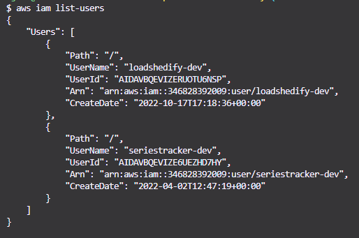

# loadshedify

loadshedify is a Discord Bot that consumes EskomSePush Business API v2.0 for the Build Challenge as well as Discord API to send messages inside of a Discord Server.

## Overview

This bot uses Serverless Infrastructure hosted in AWS. This is done with AWS Serverless Application Model (SAM).

A quick breakdown of this project:

- Makefile - local script to get everything up and running, essentially mimicing what CI/CD would do in a real world scenario
- template.yaml - Infrastructure as Code using AWS SAM & CloudFormation
- src/Proxy - .NET Projects housing Lambda Functions which can be seen as the 'Bot Commands', i.e. `/help`
- src/scripts - Some scripts to tie everything together (dev & live things)

## Tools & CLI

- [.NET 6.0](https://dotnet.microsoft.com/en-us/download/dotnet/6.0)
- [Node 16+](https://nodejs.org/en/)
  - yarn - optional, via `npm i yarn -g`
- [AWS cli](https://aws.amazon.com/cli/)
- [AWS sam cli](https://docs.aws.amazon.com/serverless-application-model/latest/developerguide/serverless-sam-cli-install.html)
- Make cli
  - Windows - via [chocolatey](https://chocolatey.org/install), run: `choco install make`
  - [Mac](https://stackoverflow.com/questions/10265742/how-to-install-make-and-gcc-on-a-mac) - `brew install make`
- Discord; and:
  - a valid Discord account
  - create an applcation via [Discord Developer Portal](https://discord.com/developers/applications)
  - NOTE DOWN the `APPLICATION ID`, `PUBLIC KEY` and `BOT TOKEN` (under **Bot**)

## Pre-requisites

Once you have all the Tools & CLIs installed. Lets setup a an IAM user quick as we need access to AWS resources.

Please follow this guide: https://docs.aws.amazon.com/IAM/latest/UserGuide/id_users_create.html. For purposes of quickness, the user can just have admin access.

Once you have that you can continue. Try run `aws iam list-users` to see if it's connecting. You should see at least your user you just created, for example my `loadshedify-dev`:

## Setup

Now that AWS is setup, the rest of setup for this project should be quite painless which just includes Discord and running the Infrastructure as Code:

- Create an Applcation under Discord Developer Portal: https://discord.com/developers/applications
  - Can name it whatever, this will be the name of your Discord Bot
- Note down the **APPLICATION_ID** and **PUBLIC_KEY**, for eg:
  - **APPLICATION_ID** = 1031614407991623710
  - **PUBLIC_KEY** = e6d00f15af414e06f07ad21ef9668f1292e0611647e946de664257df59f33e48
- From the application, head to **Bot** section in the left navigation
  - Click "Add Bot"
  - **NOTE:** If you have a generic name like 'test' that is used a lot, you'll get an error. Go back to **General Information** to change the name
  - Now that this application has a Bot assigned to it, you'll need to get the **BOT_TOKEN**
  - Click the "Reset Token" and note down **BOT_TOKEN**, for eg:
    - **BOT_TOKEN** = MTAzMTYxNDQwNzk5MTYyMzcxMA.GikmU9.JbGHdEID3LxNzvtDI7n3NR2NH2PCgTw1McwD8Y
    - **NOTE:** This value is only shown once, if you forget to copy / lose it you can reset it and retrieve a new one
- `yarn` / `npm install`
- make all

This should setup the entire infrastructure
